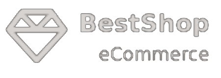

<a id="readme-top"></a>


<!-- PROJECT SHIELDS -->
<!--
*** I'm using markdown "reference style" links for readability.
*** Reference links are enclosed in brackets [ ] instead of parentheses ( ).
*** See the bottom of this document for the declaration of the reference variables
*** for contributors-url, forks-url, etc. This is an optional, concise syntax you may use.
*** https://www.markdownguide.org/basic-syntax/#reference-style-links
-->
<!--
[![Contributors][contributors-shield]][contributors-url]
[![Forks][forks-shield]][forks-url]
[![Stargazers][stars-shield]][stars-url]
[![Issues][issues-shield]][issues-url]
[![Unlicense License][license-shield]][license-url]
[![LinkedIn][linkedin-shield]][linkedin-url]
-->
<!-- PROJECT LOGO -->
<br />
<div align="center">
    <a href="https://github.com/zsoltdzsugan/bestshop">
        
    </a>

  <p align="center">
    BestShop is a multi-vendor e-commerce platform built with Laravel.
    <br />
    <br />
    <!--<a href="https://bestshop-main-bhazak.laravel.cloud">View Current Demo Site</a>-->
    <!-- &middot; -->
    <!-- <a href="https://github.com/othneildrew/Best-README-Template/issues/new?labels=bug&template=bug-report---.md">Report Bug</a> -->
    <!-- &middot; -->
    <!-- <a href="https://github.com/othneildrew/Best-README-Template/issues/new?labels=enhancement&template=feature-request---.md">Request Feature</a> -->
  </p>
</div>


<!-- TABLE OF CONTENTS -->
<details>
  <summary>Table of Contents</summary>
  <ol>
    <li>
      <a href="#about-the-project">About The Project</a>
      <ul>
        <li><a href="#built-with">Built With</a></li>
      </ul>
    </li>
    <li>
      <a href="#getting-started">Getting Started</a>
      <ul>
        <li><a href="#prerequisites">Prerequisites</a></li>
        <li><a href="#installation">Installation</a></li>
      </ul>
    </li>
    <li><a href="#usage">Usage</a></li>
    <li><a href="#roadmap">Roadmap</a></li>
    <li><a href="#upcoming">Upcoming Features</a></li>
    <!-- <li><a href="#contributing">Contributing</a></li> -->
    <!-- <li><a href="#license">License</a></li> -->
    <li><a href="#contact">Contact</a></li>
    <!-- <li><a href="#acknowledgments">Acknowledgments</a></li> -->
  </ol>
</details>


<!-- ABOUT THE PROJECT -->
## About The Project

[![Product Name Screen Shot][product-screenshot]]()
[![Product Name Screen Shot 1][product-screenshot-1]]()
This project is currently in development.
The site is designed as a multi-vendor ecommerce site (similar to amazon), it provides a seamless online shopping experience.

<p align="right">(<a href="#readme-top">back to top</a>)</p>


### Built With

This section should list any major frameworks/libraries used to bootstrap your project. Leave any add-ons/plugins for the acknowledgements section. Here are a few examples.

* [![Laravel][Laravel.com]][Laravel-url]
* [![Blade][blade.com]][Laravel-url]
* [![AlpineJs][alpine.com]][alpine-url]
* [![TailwindCSS][tailwind.com]][tailwind-url]
* [![JQuery][JQuery.com]][JQuery-url]
* [![MySQL][mysql.com]][mysql-url]

<p align="right">(<a href="#readme-top">back to top</a>)</p>


<!-- GETTING STARTED -->
## Getting Started

### Prerequisites

This is an example of how to list things you need to use the software and how to install them.
* npm
  ```sh
  npm install npm@latest -g
  ```

### Installation

1. **Clone the repository**  
    ```sh
    git clone https://github.com/zsoltdzsugan/bestshop.git
    cd bestshop
    ```
2. **Install dependencies**  
    ```sh
    composer install
    npm install
    ```
3. **Copy the environment file and genereate application key**  
    ```sh
    cp .env.example .env
    php artisan key:generate
    ```
4. **Build and start the containers**  
    ```sh
    docker compose up -d
    ```
5. **Run migrations and seed database**  
    ```sh
    docker compose exec laravel.test php artisan migrate --seed
    ```
6. **Link storage**  
    ```sh
    docker compose exec laravel.test php artisan storage:link
    ```
7. **Run frontend dependencies**  
    ```sh
    npm run dev
    ```
8. **Access the application**  
    ```sh
    http://localhost
    ```

<p align="right">(<a href="#readme-top">back to top</a>)</p>


<!-- USAGE EXAMPLES -->
## Usage

Additional information

#### Environment Variables
```sh
    APP_NAME=Laravel
    APP_URL=http://localhost
    
    DB_CONNECTION=mysql
    DB_HOST=mysql
    DB_PORT=3306
    DB_DATABASE=bestshop
    DB_USERNAME=sail
    DB_PASSWORD=password
```
#### Seeded Test Users
```sh
    name: Test Admin
    username: admin
    email: admin@test.com
    password: password

    name: Test Vendor
    username: vendor
    email: vendor@test.com
    password: password

    name: Test User
    username: user
    email: user@test.com
    password: password
```

<p align="right">(<a href="#readme-top">back to top</a>)</p>


<!-- ROADMAP -->
## Roadmap

- [x] User Authentication
- Admin Panel
- [x] Dashboard
- [x] User Management
- [ ] Site Management
- [x] Shops Management
- [x] Brands Management
- [x] Product Management
- Vendor Panel
- [x] Dashboard
- [x] Own Shop Management
- [x] Own Product Management
- Frontend
- - [x] Main Page design
- - [x] Flash Sale Page design
- - [x] User Dashboard design

See the [open issues](https://github.com/zsoltdzsugan/bestshop/issues) for a full list of proposed features (and known issues).

<p align="right">(<a href="#readme-top">back to top</a>)</p>


## Upcoming Features

- **Shopping Cart**: Add items to the cart and manage quantities.
- **Order Processing**: Checkout system with order tracking.
- **Responsive UI**: A modern and mobile-friendly interface.

<p align="right">(<a href="#readme-top">back to top</a>)</p>


<!-- <!-1- LICENSE -1-> -->
<!-- ## License -->

<!-- Distributed under the Unlicense License. See `LICENSE.txt` for more information. -->

<!-- <p align="right">(<a href="#readme-top">back to top</a>)</p> -->


<!-- CONTACT -->
## Contact

Your Name - [@zsolt-dzsugan](https://www.linkedin.com/in/zsolt-dzsugan/) - zsolt.dzsugan@gmail.com

Project Link: [https://github.com/zsoltdzsugan/bestshop.git](https://github.com/zsoltdzsugan/bestshop.git)

<p align="right">(<a href="#readme-top">back to top</a>)</p>


<!-- <!-1- ACKNOWLEDGMENTS -1-> -->
<!-- ## Acknowledgments -->

<!-- Use this space to list resources you find helpful and would like to give credit to. I've included a few of my favorites to kick things off! -->

<!-- * [Choose an Open Source License](https://choosealicense.com) -->
<!-- * [GitHub Emoji Cheat Sheet](https://www.webpagefx.com/tools/emoji-cheat-sheet) -->
<!-- * [Malven's Flexbox Cheatsheet](https://flexbox.malven.co/) -->
<!-- * [Malven's Grid Cheatsheet](https://grid.malven.co/) -->
<!-- * [Img Shields](https://shields.io) -->
<!-- * [GitHub Pages](https://pages.github.com) -->
<!-- * [Font Awesome](https://fontawesome.com) -->
<!-- * [React Icons](https://react-icons.github.io/react-icons/search) -->

<!-- <p align="right">(<a href="#readme-top">back to top</a>)</p> -->


<!-- MARKDOWN LINKS & IMAGES -->
<!-- https://www.markdownguide.org/basic-syntax/#reference-style-links -->
[github-url]: https://github.com/zsoltdzsugan/bestshop
[contributors-shield]: https://img.shields.io/github/contributors/othneildrew/Best-README-Template.svg?style=for-the-badge
[contributors-url]: https://github.com/othneildrew/Best-README-Template/graphs/contributors
[forks-shield]: https://img.shields.io/github/forks/othneildrew/Best-README-Template.svg?style=for-the-badge
[forks-url]: https://github.com/othneildrew/Best-README-Template/network/members
[stars-shield]: https://img.shields.io/github/stars/othneildrew/Best-README-Template.svg?style=for-the-badge
[stars-url]: https://github.com/othneildrew/Best-README-Template/stargazers
[issues-shield]: https://img.shields.io/github/issues/othneildrew/Best-README-Template.svg?style=for-the-badge
[issues-url]: https://github.com/othneildrew/Best-README-Template/issues
[license-shield]: https://img.shields.io/github/license/othneildrew/Best-README-Template.svg?style=for-the-badge
[license-url]: https://github.com/othneildrew/Best-README-Template/blob/master/LICENSE.txt
[linkedin-shield]: https://img.shields.io/badge/-LinkedIn-black.svg?style=for-the-badge&logo=linkedin&colorB=555
[linkedin-url]: https://linkedin.com/in/othneildrew
[product-screenshot]: public/assets/home_page_l.png
[product-screenshot-1]: public/assets/admin_panel.png
[blade.com]: https://img.shields.io/badge/Blade-DD0031?style=for-the-badge&logo=blade&logoColor=white
[Laravel.com]: https://img.shields.io/badge/Laravel-FF2D20?style=for-the-badge&logo=laravel&logoColor=white
[Laravel-url]: https://laravel.com
[tailwind.com]: https://img.shields.io/badge/tailwindcss-%2338B2AC.svg?style=for-the-badge&logo=tailwind-css&logoColor=white
[tailwind-url]: https://tailwindcss.com/
[alpine.com]: https://img.shields.io/badge/alpinejs-white.svg?style=for-the-badge&logo=alpinedotjs&logoColor=%238BC0D0
[alpine-url]: https://alpinejs.dev/
[javascript.com]: https://img.shields.io/badge/javascript-%23323330.svg?style=for-the-badge&logo=javascript&logoColor=%23F7DF1E
[javascript-url]: https://alpinejs.dev/
[JQuery.com]: https://img.shields.io/badge/jQuery-0769AD?style=for-the-badge&logo=jquery&logoColor=white
[JQuery-url]: https://jquery.com 
[mysql.com]: https://img.shields.io/badge/MySQL-00758f?style=for-the-badge&logo=mysql&logoColor=white
[mysql-url]: https://www.mysql.com/
